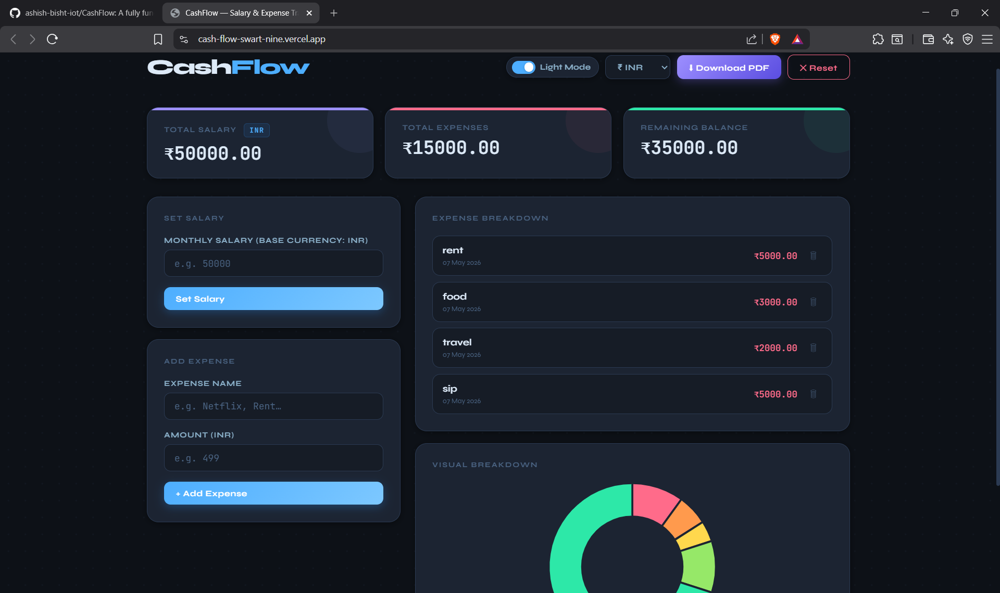
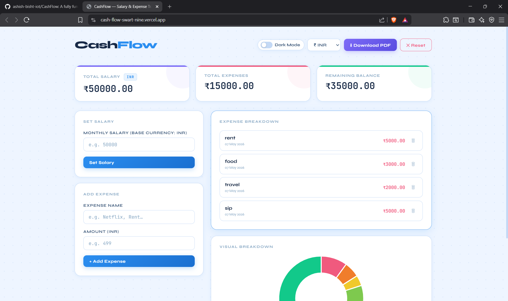
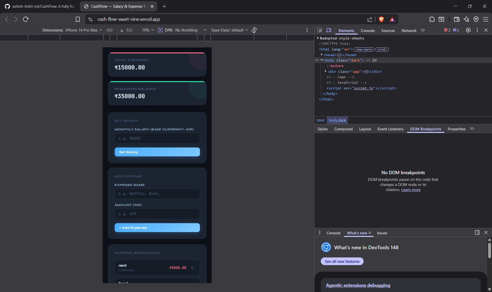
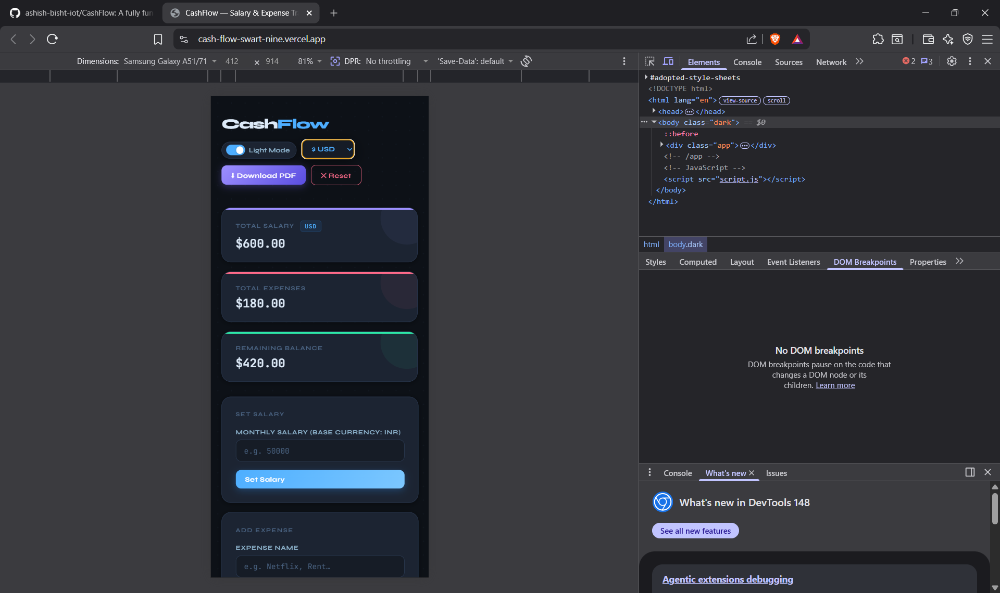

# 💸 CashFlow — Salary & Expense Tracker

A fully functional, beautifully designed **Salary & Expense Tracker** built with **Vanilla JavaScript**, **HTML5**, and **CSS3** — no frameworks, no React, just raw web fundamentals.

---

## 🚀 Live Features

### ✅ Level 1 — Core Logic
- Set your **monthly salary** and display it instantly on screen
- Add expenses with a **name** and **amount**
- Auto-calculates: `Total Salary − Total Expenses = Remaining Balance`
- **Input validation** — blocks empty fields and negative/zero amounts
- Real-time DOM updates — no page reload needed

### ✅ Level 2 — Persistence & Visualization
- **localStorage** — all data survives a page refresh
- **Delete expenses** with an animated trash button; balance updates instantly
- **Chart.js Doughnut Chart** — visual split of Remaining Balance vs Total Expenses

### ✅ Level 3 — Advanced Features
- **PDF Export** via `jsPDF` — generates a formatted report with summary table and expense list
- **Live Currency Converter** — switch between ₹ INR, $ USD, € EUR, £ GBP, ¥ JPY using the [Frankfurter API](https://api.frankfurter.app) (no API key required)
- **Budget Alert** — balance text turns red and a warning banner appears when balance drops below **10% of salary**

### 🎨 Bonus — UI/UX Polish
- **Light / Dark Mode toggle** — preference saved to localStorage
- White & sky-blue light theme with a soft dot-grid background
- Rich **hover effects** on every interactive element
- Smooth animations: slide-in expenses, chart rotation, pulse alert
- Fully **responsive** — works on mobile and desktop

---

## 📁 Project Structure

```
cashflow/
│
├── index.html       # HTML structure — single div.app wrapper, no inline styles or scripts
├── styles.css       # All CSS — themes, layout, animations, hover effects
├── script.js        # All JavaScript — state, DOM, localStorage, API, chart, PDF
└── README.md        # This file
```

## 🛠️ Tech Stack

| Technology | Purpose |
|---|---|
| HTML5 | Page structure and semantic markup |
| CSS3 | Styling, theming (CSS variables), animations |
| Vanilla JavaScript (ES6+) | All app logic, DOM manipulation, data persistence |
| [Chart.js v4](https://www.chartjs.org/) | Doughnut chart visualization |
| [jsPDF v2](https://github.com/parallax/jsPDF) | PDF report generation |
| [Frankfurter API](https://www.frankfurter.app/) | Live currency exchange rates |
| localStorage | Client-side data persistence |

---

## 🧠 Key JavaScript Concepts Used

- **DOM Manipulation** — `getElementById`, `innerHTML`, `classList`, `addEventListener`
- **Event Listeners** — button clicks, input `keydown`, select `change`
- **Type Coercion** — `Number()` / `parseFloat()` to prevent the classic `"10" + "10" = "1010"` bug
- **localStorage** — `JSON.stringify()` to save, `JSON.parse()` to restore arrays/objects
- **Async/Await + Fetch API** — for live currency rates
- **Chart.js** — via CDN, destroyed and re-created on each update
- **jsPDF** — client-side PDF generation with custom layout

---

## 📸 Screenshots

### 🖥️ Desktop View — Dark Mode



### ☀️ Desktop View — Light Mode



### 📱 Mobile — iPhone 14 Pro Max



### 🤖 Mobile — Android (Samsung Galaxy A51)



